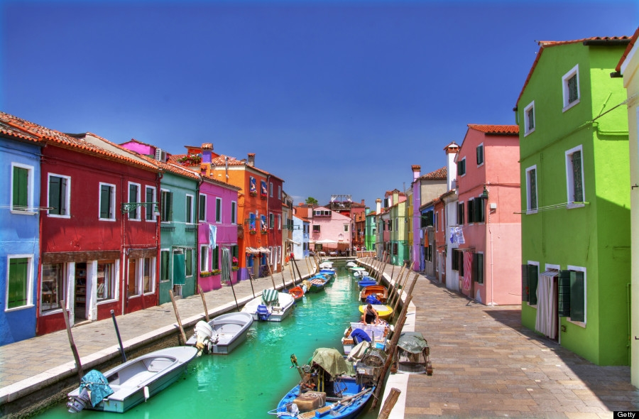
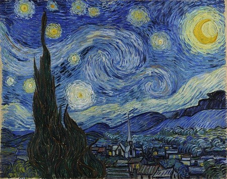
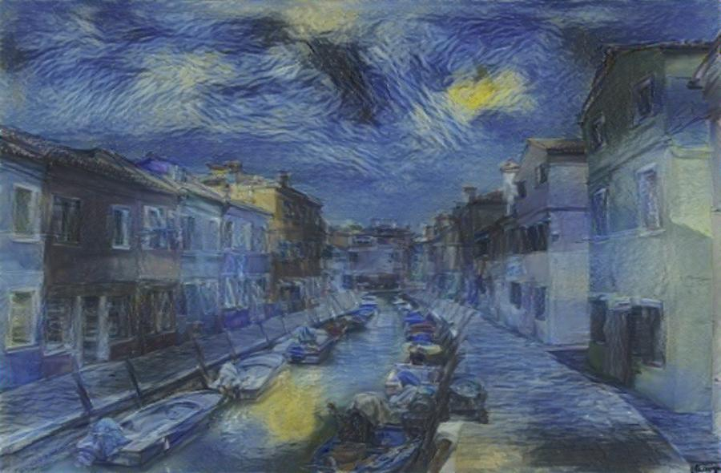
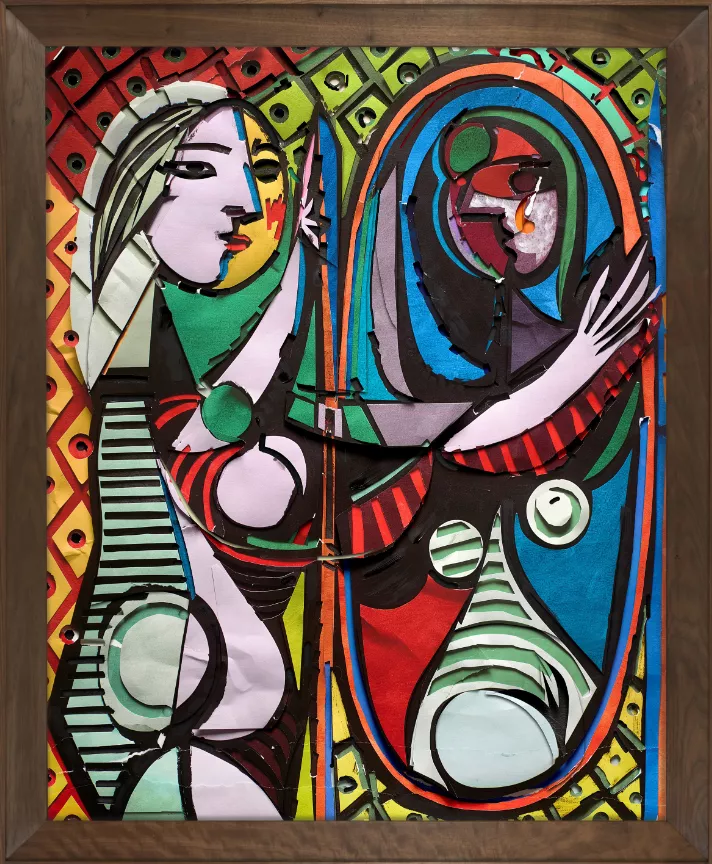
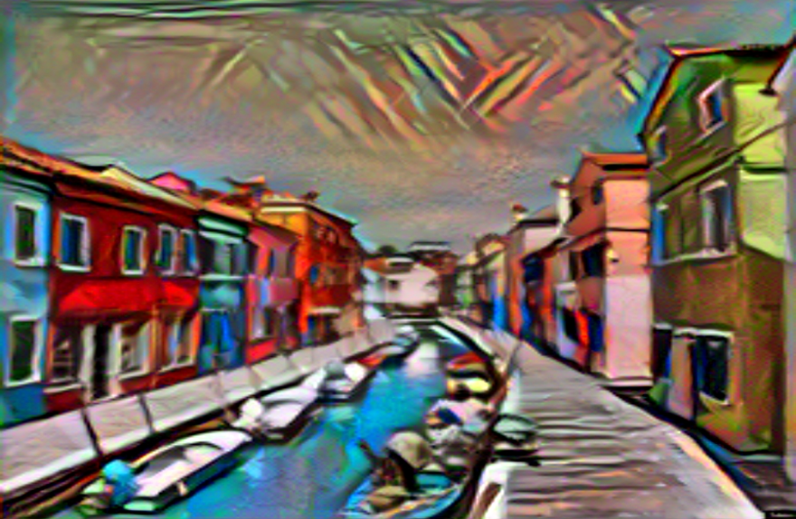

# Neural Style Transfer

## Overview

This project applies neural style transfer (NST) to transform an input image by adopting the artistic style of another image. NST leverages convolutional neural networks (CNNs) to separate and recombine content and style, producing visually striking results.

## Results

The generated image is saved in the folder `results`

<tr>
<table align="center">
  <tr>
    <td align="center"></td>
    <td align="center" style="font-size: 30px; font-weight: bold;"> + </td>
    <td align="center"></td>
    <td align="center" style="font-size: 30px; font-weight: bold;"> = </td>
    <td colspan="4" align="center"></td>
  </tr>
</table>

<tr>
<table align="center">
  <tr>
    <td align="center"></td>
    <td align="center" style="font-size: 30px; font-weight: bold;"> + </td>
    <td align="center"></td>
    <td align="center" style="font-size: 30px; font-weight: bold;"> = </td>
    <td colspan="4" align="center"></td>
  </tr>
</table>

## Streamlit App

Deploy model on streamlit

`streamlit run streamlit.py`

The interface of the streamlit app looks like this, you can upload an image for `content` and another image for `style` and choose the `step size` before start transfer:

## Huggingface Space

Deploy model on huggingface, you can visit via link:

`https://huggingface.co/spaces/TungDuong/image_style_transfer`

The interface in the huggingface look like this:

